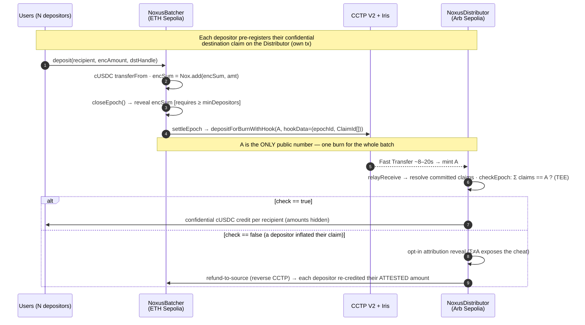

<div align="center">

# Noxus

### Confidential cross-chain USDC settlement over Circle CCTP V2

**Individual amounts never touch the blockchain.** Encrypted deposits are batched on Ethereum Sepolia, one public aggregate bridges via [Circle CCTP V2](https://developers.circle.com/cctp), and distribution on Arbitrum Sepolia is confidential — gated by an on-chain, TEE-verified integrity check that makes cheating detectable and self-punishing.

[](#whats-verified-live)
[](#live-deployments)
[](https://developers.circle.com/cctp)
[](https://docs.noxprotocol.io)
[](#license--disclaimer)

*Built for the iExec hackathon. Privacy layer over a real, unmodified open-source protocol via **batching**.*
*Positioning: **confidentiality, not anonymity** — participants visible, amounts never. Audit-friendly by design, not a mixer.*

</div>

---

## The problem

`depositForBurn(amount, …)` is a **public event**. Every CCTP treasury move — the ones Coinbase, Kraken, and payroll processors make every day — broadcasts position sizes and flow timing to anyone reading Etherscan. Mixers answer with anonymity (regulatorily radioactive). Mind Network encrypts the *message in transit* — but the burn amount still sits on-chain regardless.

**Noxus makes individual amounts *never exist on-chain*, while the aggregate stays fully auditable.**

## How it works



**What an observer sees per epoch:** the participant set (visible), the recipient set (visible), and the aggregate `A` (one public number, unavoidable) — but never a per-user deposit, never a per-recipient payout, never any individual amount. An auditor can still be granted a view of any single amount on demand via an on-chain ACL grant. Note: these grants are **add-only and irrevocable on-chain** — iExec Nox has no `removeViewer`, so a granted viewer can decrypt that one amount forever; on-chain revocation is future work (see [SECURITY.md](SECURITY.md)).

### The integrity check — why cheating doesn't pay

Nox handles are **chain-scoped**, so each depositor encrypts their amount twice: once for the source-side sum, once as a fresh input for the destination. Nothing cryptographically binds the two plaintexts — so an attacker could try to inflate their destination claim. Noxus catches this **on-chain, in the TEE, before any money moves**:

```solidity
euint256 total = Σ Nox.fromExternal(claim_i);     // encrypted sum of destination claims
ebool ok = Nox.eq(total, toEuint256(mintedA));    // does it equal the public aggregate?
Nox.allowPublicDecryption(ok);                     // reveal only the boolean
```

- `true` → confidential distribution (the honest equilibrium).
- `false` → the epoch flags itself. Recipients opt-in to reveal their own claim (exposing `Σ ≠ A`), then the aggregate is **bridged back** and every depositor is confidentially re-credited their **attested source amount**. The cheater cannot claim more than they deposited; honest users keep their privacy. **Cheating is detectable, unprofitable, and self-exposing.**

**Defensible claim:** *first amount-confidential CCTP settlement via TEE batching with verifiable integrity.*

---

## What's verified live

Both critical flows run **end-to-end on real testnets with zero mock data** (real USDC, real Iris attestations, real Nox KMS proofs):

| Flow | Result |
|---|---|
| **Honest epoch** | 3 hidden deposits (0.10 / 0.15 / 0.20 USDC) → bridged aggregate `A = 0.45` → **integrity check == 1** → confidential distribution → recipient decrypts their balance |
| **Adversarial epoch** | depositor inflates their claim to `0.99` → `Σ = 1.24 ≠ A = 0.45` → **check == 0** → attribution reveal exposes the cheat → refund-to-source credits attested amounts (cheater gets 0.20, not 0.99) |
| **Latency** | Nox reveal round-trip ~2–7 s (GO-LIVE tier) — fast enough for a live demo; block confirmation, not the TEE, is the bottleneck |
| **Privacy audit** | exactly 3 legal `allowPublicDecryption` sites, no amount leakage in events, no branching on encrypted values |

Reproduce with the scripts in [`scripts/`](scripts/) — see [Quickstart](#quickstart).

## Live deployments

The bridge is **bidirectional** — every chain hosts both a `NoxusBatcher` and a `NoxusDistributor`, so it settles either way (ETH→Arb *and* Arb→ETH). Both directional pairs are proven live end-to-end, and all six contracts are **verified on [Sourcify](https://sourcify.dev)** (`exact_match`) under their Noxus source names.

| Contract | Chain | Address | Role |
|---|---|---|---|
| `NoxusCUSDC` (cUSDC) | ETH Sepolia | [`0x47d150…e41C`](https://sepolia.etherscan.io/address/0x47d150572dFCEB75C27b6dDf5EADc4D6fa33e41C) | confidential USDC |
| `NoxusCUSDC` (cUSDC) | Arb Sepolia | [`0xD74A1F…0209`](https://sepolia.arbiscan.io/address/0xD74A1F2bF0285Dc64F7855D0233E774772Ab0209) | confidential USDC |
| `NoxusBatcher` | ETH Sepolia | [`0x814a70…4E37`](https://sepolia.etherscan.io/address/0x814a70961395218365DA5892F5de768a9Ed84E37) | source · ETH→Arb |
| `NoxusDistributor` | Arb Sepolia | [`0x410195…0ECFA`](https://sepolia.arbiscan.io/address/0x410195cF6137661B066d4264515C6dc9b860ECFA) | dest · ETH→Arb |
| `NoxusBatcher` | Arb Sepolia | [`0x47Cd12…4d30`](https://sepolia.arbiscan.io/address/0x47Cd125B48970D899bD9C7434187a8C5c5214d30) | source · Arb→ETH |
| `NoxusDistributor` | ETH Sepolia | [`0x073A21…bfb0`](https://sepolia.etherscan.io/address/0x073A213Be93EC6B5aD830e466DA95603450bbfb0) | dest · Arb→ETH |

> Interacts with **unmodified official deployments**: Circle CCTP V2 (`TokenMessengerV2` `0x8FE6…2DAA`, `MessageTransmitterV2` `0xE737…CE275`, identical on both testnets) and iExec Nox (`NoxCompute`). CCTP domains: Ethereum = 0, Arbitrum = 3. The contracts are direction-agnostic (CCTP domain + remote peer are constructor params), so a new chain is a deploy + wire once iExec Nox extends beyond these two testnets.

## The app

The frontend is a **single in-browser bridge widget**. You enter an amount and a destination; the widget then drives the *entire* confidential cross-chain flow from your wallet — wrap USDC → cUSDC, pre-register, deposit (encrypted), close, settle + CCTP burn, relay, TEE integrity check, and confidential distribution — with a live step tracker. A **Track** tab scans both contracts and lists any bridges still in flight (and the phase each is stuck at). No scripts required to bridge.

Run it locally (`cd frontend && npm install && npm run dev`) or deploy it to Vercel with the repo's `vercel.json` — see [`docs/DEPLOY_VERCEL.md`](docs/DEPLOY_VERCEL.md).

---

## Architecture

| Contract | Chain | Role |
|---|---|---|
| [`NoxusBatcher.sol`](contracts/NoxusBatcher.sol) | ETH Sepolia | Confidential deposits → encrypted sum → epoch settle → unwrap → `depositForBurnWithHook`; receives the refund leg |
| [`NoxusDistributor.sol`](contracts/NoxusDistributor.sol) | Arb Sepolia | CCTP mint + hook → integrity check → confidential distribution / fallback + refund |
| [`NoxusCUSDC.sol`](contracts/NoxusCUSDC.sol) ×2 | both | Thin deploy of iExec's official `ERC20ToERC7984Wrapper` around testnet USDC |
| [`CCTPMessageParser.sol`](contracts/lib/CCTPMessageParser.sol) | — | Reads CCTP V2 message fields by verified offset |
| CCTP V2, NoxCompute | both | **Unmodified official deployments — called, never touched** |

**Design invariants:** handles are chain-scoped (no cross-chain handle use); every plaintext reveal is a two-tx pattern (`allowPublicDecryption` → off-chain KMS proof → on-chain `publicDecrypt`); every function is permissionless (guarded by state + on-chain proof verification, not caller identity); the k-anonymity floor (`minDepositors`) is enforced at close and settle.

### Tech stack

- **Contracts:** Solidity `0.8.35`, Hardhat 2, [iExec Nox](https://docs.noxprotocol.io) (`@iexec-nox/nox-protocol-contracts`, `@iexec-nox/nox-confidential-contracts` — ERC-7984 confidential tokens + TEE), OpenZeppelin.
- **Bridge:** [Circle CCTP V2](https://developers.circle.com/cctp) Fast Transfer + Hooks, Iris attestation API.
- **Scripts / SDK:** TypeScript, ethers v6, `@iexec-nox/handle` (client-side encrypt / decrypt / publicDecrypt).
- **Frontend:** Vite + React + wagmi/viem + the Nox handle SDK.

## Repository layout

```
noxus/
├── contracts/           NoxusBatcher · NoxusDistributor · NoxusCUSDC · lib/ · interfaces/
├── scripts/             00 wrappers · 01 batcher · 02 deploy+wire · 03 seed · 04 honest E2E
│                        05/05b/05c fallback+refund · bench_nox_latency · audit_privacy · verify_sourcify
├── frontend/            Vite/React dApp — single in-browser confidential bridge widget (Bridge + Track)
├── docs/                SPEC.md (full spec + worklog) · PLAN.md · DEMO_SCRIPT.md · X_POST.md
├── deployments/         live addresses per chainId
├── feedback.md          iExec tooling feedback (required deliverable)
└── hardhat.config.cjs · .env.example
```

## Quickstart

```bash
git clone https://github.com/aydi26/iexec_WTF && cd iexec_WTF
pnpm install
cp .env.example .env      # add a funded testnet key + RPCs (see below)
pnpm exec hardhat compile
```

`.env` (git-ignored from commit #1 — **never commit it**):

```ini
DEPLOYER_PRIVATE_KEY=0x…        # funded on ETH Sepolia + Arb Sepolia (ETH for gas) + USDC via faucet.circle.com
KEEPER_PRIVATE_KEY=0x…          # can be the same account (everything is permissionless)
ETH_SEPOLIA_RPC_URL=…
ARB_SEPOLIA_RPC_URL=…
```

Run the flows against the live deployments (or redeploy first with `02_deploy_cross_chain.ts`):

```bash
pnpm exec tsx scripts/04_honest_e2e.ts        # DoD ① — honest confidential settlement
pnpm exec tsx scripts/05_fallback_e2e.ts      # DoD ② — adversarial fallback + refund
pnpm exec tsx scripts/audit_privacy.ts        # static privacy audit (3 reveal sites, no leakage)
pnpm exec tsx scripts/bench_nox_latency.ts    # KMS latency GO/NO-GO bench
```

Frontend — the single in-browser bridge widget (no scripts needed to bridge):

```bash
cd frontend && npm install && npm run dev   # http://localhost:5173
```

Connect a wallet on Ethereum Sepolia, enter an amount + destination, and the widget runs the whole confidential cross-chain flow for you (approving each network switch when prompted).

Faucets: [Sepolia ETH](https://sepoliafaucet.com) · [Arbitrum Sepolia ETH](https://faucet.quicknode.com/arbitrum/sepolia) · [Circle USDC](https://faucet.circle.com) (20 USDC / 2h / address).

---

## Privacy model

**Guaranteed by construction**
- Individual amounts are never emitted, stored, or derivable on-chain.
- Amount-correlation between source depositor and destination recipient is broken (no amount appears on either leg).
- Per-handle selective disclosure to auditors via on-chain ACL.

**Documented, not hidden**
- The aggregate `A` is public (it's the CCTP burn amount). Privacy requires **k ≥ 2 depositors/epoch**; `settleEpoch` reverts below `minDepositors` (demo: 3). `minDepositors` is a heuristic floor against honest-but-curious observers, not adversarial co-depositors.
- The wrap boundary is public. Mitigation: pre-fund cUSDC once, bridge many hidden amounts later.
- Participant sets & timing are visible — **confidentiality, not anonymity**.
- Inherited trust: Circle (same as holding USDC at all) + Nox infra (TEE runners, threshold KMS, gateway).

## Related work

**Mind Network** (FHE layer for CCTP) encrypts the *message payload* in transit — but the burn amount is an on-chain event whatever the message says, so encrypting the envelope hides nothing from Etherscan. Noxus attacks the on-chain layer: amounts never exist there, only the aggregate, and cross-chain consistency is TEE-verified. Different stack (TEE/Nox vs FHE), path (direct CCTP V2 Hooks vs via CCIP), and mechanism (batching + integrity check vs payload encryption). **Mixers** provide anonymity sets; Noxus takes the opposite compliance posture.

## More

- [`docs/SPEC.md`](docs/SPEC.md) — full technical spec, verified facts, constraints, decision log, and session worklog.
- [`docs/DEMO_SCRIPT.md`](docs/DEMO_SCRIPT.md) — the ≤4-minute demo shot list.
- [`feedback.md`](feedback.md) — feedback on the iExec tooling (required deliverable).

## Team

**Aiden** — [X](https://x.com/aiden_7788) · [Telegram](https://t.me/aiden_7788)

## Security

An independent audit found no fund-theft path with an honest deployer, confirmed the encrypted integrity check cannot be passed with `Σ ≠ A`, and confirmed no individual amount appears on-chain (exactly 3 reveal sites). Several findings were hardened (immutable peer wiring, keyed claim pre-registration, checks-effects-interactions on the refund path). Accepted testnet limitations remain: an operator-funded fee buffer that must be monitored, a single active epoch per Batcher, **irrevocable auditor grants** (Nox has no `removeViewer`), and trust in the young iExec Nox TEE + KMS + gateway stack. Full findings, severities, and the "not for mainnet without" list are in [SECURITY.md](SECURITY.md). **Testnet-only, unaudited beyond this review — not for mainnet.**

## License & disclaimer

Our code is **MIT**. It interacts with unmodified third-party deployments (Circle CCTP V2, iExec Nox — their licenses apply). The frontend UI shell is adapted from our earlier hackathon project; all Noxus protocol logic is new.

>  **Testnet-only, unaudited, hackathon software — never use with real funds.** Not affiliated with Circle or iExec.
