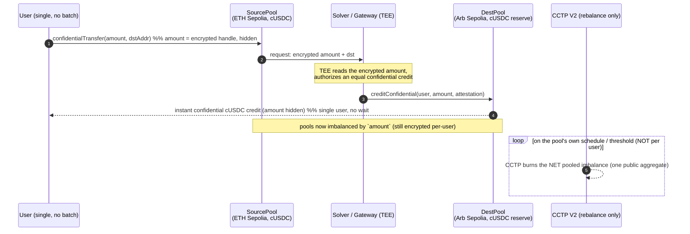

# Noxus — Single-user confidential bridge: is it possible?

> Research synthesis from a full read of the Circle CCTP V2 docs + source, the iExec Nox
> docs + installed source (node_modules, ground truth), and prior art on intent/liquidity
> bridges and confidential-transfer systems. Question: can we remove the "wait for a batch
> of N other depositors" and give a **single user** a confidential cross-chain USDC transfer?

## TL;DR

- **Over raw CCTP: no.** A single user's amount is revealed the moment *their own* transfer
  drives the CCTP burn. This is not a design shortcut we took — it is forced by three
  independently verified facts (below). **Batching is the only way to hide a single user's
  amount if CCTP is the per-user rail.**
- **But the actual pain — the batch wait — is solvable.** A **confidential liquidity-pool +
  solver** design gives the user an *instant, single-user, amount-hidden* experience and
  relegates CCTP to **aggregate pool rebalancing** only. The amount never appears in plaintext
  tied to the user, on either chain. This is how Across / Everclear / Circle Gateway already
  work — Noxus adds a confidential settlement leg (iExec Nox / ERC-7984) on top.
- **The cost is honest and real:** it replaces "wait for k anonymity" with "trust a solvent,
  liquid pool operator + a TEE attestation," and the aggregate rebalance still leaks pooled
  totals + timing (statistical, not information-theoretic, privacy).

---

## 1. Why a raw single-user confidential CCTP bridge is impossible (3 hard blockers)

**Blocker A — CCTP burns a plaintext amount in three unavoidable public places.**
`TokenMessengerV2.depositForBurn(uint256 amount, …)` writes `amount` as plaintext (1) in
calldata, (2) in the emitted `DepositForBurn` event, and (3) in the signed `BurnMessageV2`
body (`amount` at offset 68). The destination mint is a hardcoded `amount − feeExecuted` to
`mintRecipient`. There is no encrypted-amount variant and none on Circle's roadmap. "Fast
Transfer" is **not** a third-party filler that could privately front funds — it is Circle
attesting at soft finality via its own escrow (FTA). Circle's own words: *"1:1 burn-and-mint,
no liquidity pools or fillers."* Hooks are arbitrary bytes the core protocol does **not**
execute and **cannot** change the minted amount.
*Sources: circlefin/evm-cctp-contracts `src/v2/TokenMessengerV2.sol`, `src/messages/v2/BurnMessageV2.sol`; developers.circle.com/cctp.*

**Blocker B — iExec Nox handles and proofs are chain-locked; there is no cross-chain primitive.**
Every Nox handle stamps `block.chainid` into bytes [1–4] (`Compute._generateHandle`), and
`validateInputProof` enforces `require(chainIdInHandle == bytes4(uint32(block.chainid)), "Handle chain id mismatch")`.
Both input and decryption proofs use an EIP-712 domain that includes `chainId` **and** the
`NoxCompute` contract address, so a proof for chain A cannot verify on chain B. An exhaustive
grep of both Nox packages found **zero** bridge / cross-chain / messaging / mint-from-nothing
primitives. Nox hides amounts *within* one chain; it cannot transport value or a confidential
credit across chains by itself.
*Sources: node_modules/@iexec-nox/nox-protocol-contracts `modules/Compute.sol`, `utils/HandleUtils.sol`; nox-confidential-contracts `contracts/**` (full tree read).*

**Blocker C — the confidential↔real-USDC boundary leaks the amount too.**
`ERC20ToERC7984WrapperBase.finalizeUnwrap` makes the burned handle publicly decryptable and
`SafeERC20.safeTransfer`s that exact plaintext amount. So even destination-side, the instant a
single user converts confidential credit back to real USDC 1:1, their amount is public — the
same failure mode as the CCTP burn.
*Source: nox-confidential-contracts `token/extensions/ERC20ToERC7984WrapperBase.sol`.*

**Consequence.** Any path where the *individual user's own value* crosses the CCTP burn or the
unwrap boundary reveals that value. Hiding a single amount therefore requires either
aggregation (batching — current Noxus), fixed denominations (mixer — rejected by doctrine and
leaks via count), or **moving the public-amount event off the individual user entirely** (the
pool model, next).

---

## 2. The design that works: Noxus Pool (confidential liquidity + solver)

The trick every fast bridge uses: **decouple the user's credit from the settlement.** The user
is paid instantly from a pre-positioned reserve; the reserve is rebalanced later, in bulk.
Noxus adds: make the user's leg **confidential** (ERC-7984), and make the rebalance the *only*
public amount — and even that is a **netted pooled total**, not a per-user figure.

### What each piece is (and that Nox already ships the building blocks)

- **SourcePool** — an ERC-7984 vault the user deposits confidential cUSDC into. Nox provides
  the exact primitive: `confidentialTransferAndCall` + `IERC7984Receiver.onConfidentialTransferReceived(operator, from, euint256 amount, bytes data)` — an **atomic confidential deposit with a `data` payload** (the destination address/chain), with an encrypted accept/refund bool. The user's amount is an `euint256` handle — never plaintext on the source chain.
- **DestPool** — an ERC-7984 subclass that holds a **real USDC reserve** and can **credit the
  user confidentially** from it. Feasible because `ERC7984Base._mint(address, euint256)` is
  `internal` and overridable: a role-gated `creditConfidential(...)` mints confidential cUSDC
  backed 1:1 by the pool's own reserve — no per-user unwrap, so **no plaintext amount hits
  chain**. (Nox ships no such contract; you author the ~1 override. Nox does not forbid it.)
- **Solver / Gateway** — authorizes the destination credit equal to the source deposit. Three
  authorization options, in increasing trustlessness (§4). The cheapest reuses the fact that
  the **same off-chain Nox gateway operator signs for both chains** (distinct per-chain
  domains) — a TEE can attest "user X deposited encrypted amount A on source" and authorize the
  matching confidential credit on destination.
- **Rebalancer** — when the pools drift past a threshold (or on a timer), it moves the **net**
  imbalance via CCTP `depositForBurn`. This is the *only* public amount, it is a **pooled net
  total** on the pool's clock, and it has no 1:1 relation to any single user (Everclear reports
  ~8:1 netting ratios; the more flow, the weaker any correlation).

### Operator/relayer model is already in Nox

`setOperator(operator, until)` + `confidentialTransferFrom` let a solver contract pull a user's
confidential balance on the source chain (single user, amount hidden there) and deliver on the
destination independently — the two legs are unlinked on-chain amount-wise. This is the Nox-
native "intent/solver" shape.

---

## 3. What is hidden vs. what leaks (honest table)

| | Current Noxus (batch) | Noxus Pool (this design) |
|---|---|---|
| Per-user amount on source | hidden (encrypted, summed) | hidden (encrypted deposit) |
| Per-user amount on destination | hidden (confidential distribution) | hidden (confidential credit from reserve) |
| Public number | epoch aggregate `A` | **netted pool rebalance total** |
| Link user ↔ public number | broken by the k-set | broken by netting + timing decorrelation |
| User waits for other users? | **yes (k ≥ minDepositors)** | **no — instant, single user** |
| New trust added | none beyond Nox TEE | **pool solvency + liquidity + credit-authorizer** |
| Privacy type | k-anonymity of the sum | statistical (pooled/netted aggregate) |
| Liquidity ceiling | none | a single transfer ≤ dest-pool reserve |

**The trade is explicit:** you buy single-user instant UX and amount-hiding by adding a solvent,
liquid pool + an authorizer, and by accepting that the aggregate leaks pooled totals + timing
(mitigated by throughput, decoy rebalances, and randomized/threshold-triggered settlement).

---

## 4. Authorizing the destination credit — the one hard part, 3 options

The pool must credit *exactly* what the user deposited, without a cross-chain proof (Blocker B
forbids reusing the handle/proof). Options, worst→best on trust:

1. **TEE attestation (fastest, trust the gateway).** The Nox gateway/KMS (which already sees
   plaintext on both chains) signs "source deposit = A" → DestPool credits A. Centralized,
   instant, simplest. Same trust root Noxus already relies on for confidentiality.
2. **Bonded solver + challenge window (trust-minimized).** A solver posts a bond, credits the
   user instantly from the pool, and later proves the source deposit during a challenge window;
   fraud → bond slashed. This is the Across/Everclear economic-security model. No new crypto,
   but needs bonds + watchers.
3. **Periodic proven settlement (most trustless, slower).** Batch the credits and reconcile
   against a source-side commitment (the existing Noxus integrity-check machinery already does
   exactly this — Σ credits == Σ deposits). This re-introduces a batch, but only for
   *reconciliation/rebalance*, not for the user's UX (they were already credited instantly).

**Recommendation:** ship option 1 for the demo (it matches Noxus's existing TEE trust root and
is instant), and document option 2 as the trust-minimized path. Option 3 reuses the current
`NoxusDistributor` integrity check verbatim as the periodic rebalance reconciler.

---

## 5. How this reuses the existing Noxus code

- **Keep** `NoxusCUSDC` (the ERC-7984 wrapper) on both chains — it is the confidential USDC.
- **Keep** the integrity-check + refund machinery from `NoxusDistributor` — repurpose it as the
  **rebalance reconciler** (Σ destination credits over a window == Σ source deposits == the CCTP
  net move), which is exactly the Σ==A check already built and audited.
- **New:** `NoxusSourcePool` (ERC-7984 receiver, `onConfidentialTransferReceived`), `NoxusDestPool`
  (ERC-7984 subclass with role-gated `creditConfidential`), and a `Rebalancer` that fires the
  netted CCTP burn on a threshold. The solver/authorizer is the current keeper, upgraded to sign
  credit authorizations.
- **Net effect:** the *current* Noxus (batch) becomes the **settlement/rebalance layer**; the
  pool becomes the **instant user-facing layer**. Same contracts, re-layered.

---

## 6. Verdict & positioning

A single-user confidential *feel* is achievable and worth building; a single-user confidential
*raw CCTP burn* is provably impossible. So the honest product statement is:

> **Noxus gives instant, single-user, amount-confidential cross-chain USDC by fronting the user
> from a confidential liquidity pool and settling the pools over unmodified CCTP V2 in netted
> aggregate.** Confidentiality of amounts holds on both chains via iExec Nox; the only public
> figure is a pooled net that is decoupled from any individual user.

For the hackathon, the **batching design already shipped and proven** is the trustless,
liquidity-free core; **Noxus Pool is the v2** that trades a solvent-pool assumption for instant
single-user UX. Both are legitimate points on the same privacy/latency curve — and CCTP's public
burn is the immovable constraint that forces the choice.

*Prior art grounding: Across (intent/solver fronting), Everclear/Connext (netting ~8:1),
Circle Gateway (unified balance + async settlement), Mind Network x402z + Zama (amount hiding
over a message-payload rail, ERC-7984). Distinction: anonymity-set systems (Tornado/Railgun)
hide the link, not the amount, and collapse at an anonymity set of one — FHE/ERC-7984 is the
correct primitive for single-user amount confidentiality.*
